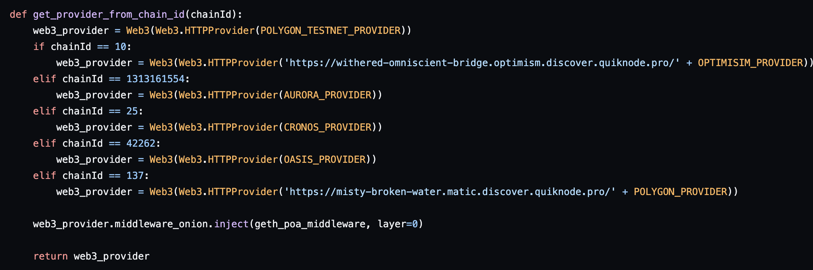
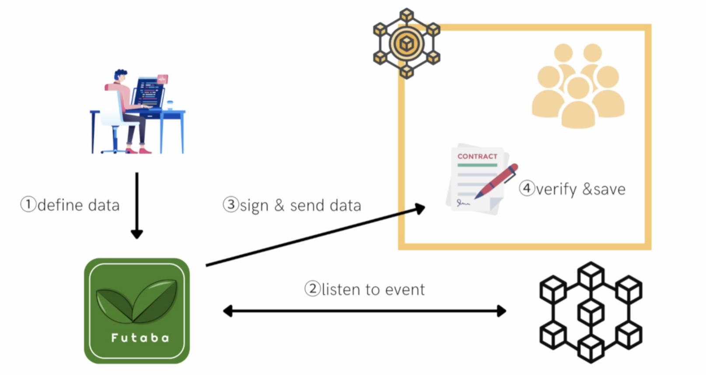

# ETHOnline 2022 -- Futaba

This is the official ETHOnline 2022 submission for our project Futaba 🍃.

## Demo Site

[Live Demo](https://node-dashboard-nine.vercel.app/)

## Project Description

Futaba is a new interoperability solution that is specialized in data acquisition. Data from other chains can be used cheaply and quickly.

### Problem 

Sending data is good, but getting data has many cons. In fact, when getting data from other chains multiple transactions are required each time, which involves
high gas fees, transactions timed consumed and unoptimized transactions. 

### Solution 

Futaba automaticaly listen to the event, sign and submit the information on the destination chain. Users can then get data saved by hitting the view function. 

We are using **Quicknode** as node provider for our Example : 

#### Quicknode

#### Structure 

## Utility 

## Twitter :
Account : [https://twitter.com/FutabaDex](https://twitter.com/FutabaDex)

## Contact Information :
Preferred contact information : You can contact the team on the address : kato_goki@andlaw.co.jp

### More Detail :
For more information about the project, please refer to [this](https://first-twine-2d1.notion.site/Lite-Paper-ae6f767832c6449d8fda1c74d0af9acf)

